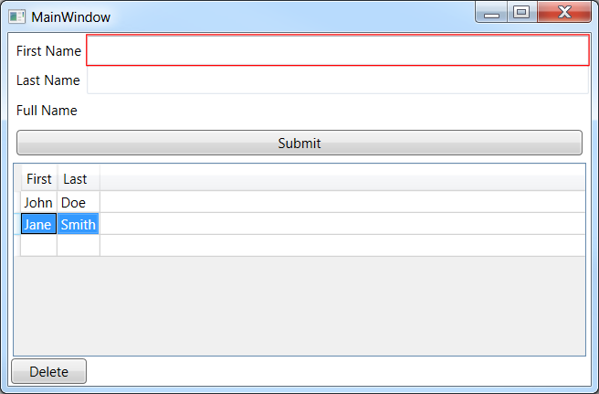

# WpfMvvmTutorial

Simple application demonstrating very basic MVVM concepts including:

1. INotifyPropertyChanged
2. Simple RelayCommand for ICommand
3. Adding an item to an ItemsSource for DataGrid/ListView
4. Design-time data
5. Simple error validation using a ValidationTemplate and DataAnnotations - copied from [Fody.Validar](https://github.com/Fody/Validar)

